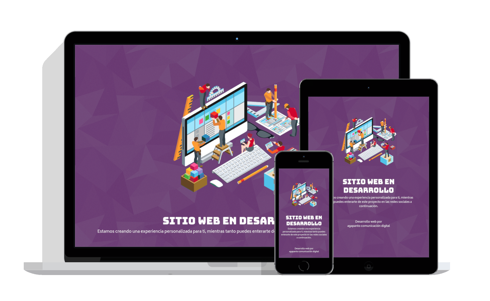

# under-construction

Create a simple, responsive "under construction" website easily with vue.js.

---
## Use cases

- You want to deploy a temporal "under construction" for you or a customer
- You (has no time / don't want) to create that site for yourself or want to use that time solving other issues.
- You need that site to be simple and responsive
- You need a Vue made website to use as template for yours

## Key features

- Vue.js made minimal frontend
- Uses Bootstrap for make the site responsive
- Configurable via env vars for customization(see `.env.dist` file)
- Deploy to Heroku or Dokku with buildpacks
- Deploy to Kubernetes cluster via Helm
- Resulting Docker image contains only `nginx` + `the built website`(as an static website) so size is arround 21 MB

## Screenshots

## Customization

You can customize this project by setting the corresponding env vars, just copy the `.env.dist` file to `.env.local`, change it's content and run `make npm-serve` to test the changes.

*Note:* in order to show the website images, all images must be publicly accessible

## Installation
- 💻 [On local machine](docs/installation.md#-on-local-machine)
- 🐋 [Using Docker](docs/installation.md#-using-docker)
- ⛵ [Using Helm(k8s)](docs/installation.md#-using-helm)
- 📦 [Deploy to heroku](docs/installation.md#-deploy-to-heroku)

## Support
If you found this project useful/time saving and want to contribute to more projects like this you can do some of the following:
- 🌟 [this project](https://github.com/agapanto/under-construction/)
- 🍻 [buy me a beer](https://www.buymeacoffee.com/mcueto)
- 💶 [donate via Paypal](https://www.paypal.me/mcuetodeveloper)

## Fork it!
This project is meant to be an start point for many vuejs projects, if you are looking for a Docker ready, PaaS ready and Kubernetes ready vuejs project, then you found it.

If you want to discuss new features, fixes, etc. Just create an Issue. I can't promise i'll respond fast, but i will respond to them eventually.

## Artwork collaborations
Are you an 🎨 and want to support this project? Just create an issue with your proposal(it can be things like fonts size, family, color, layout changes, new components that can be useful, and so on).

## About
⌨️/🧠 by [mcueto](https://marcelocueto.cl) for [agapanto](https://agapanto.cl)
